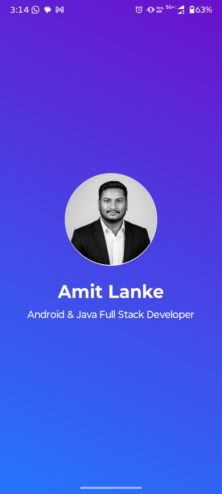
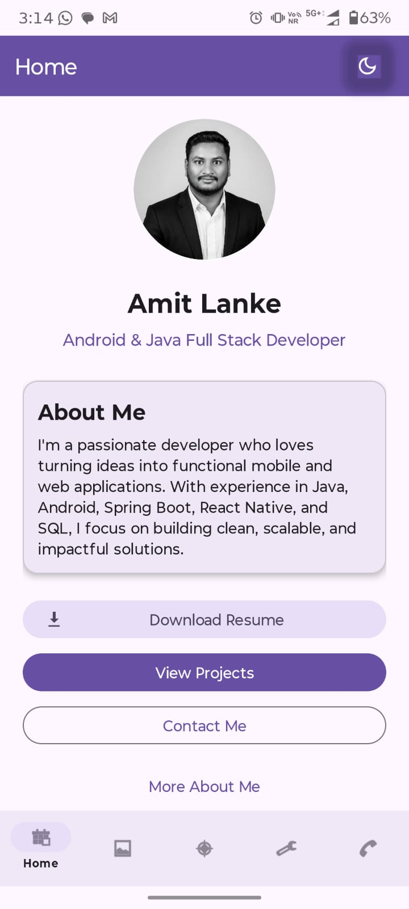
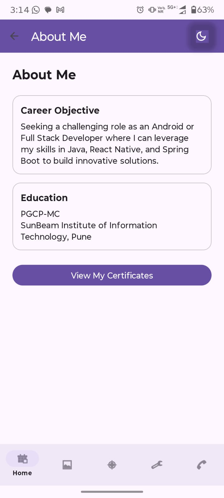
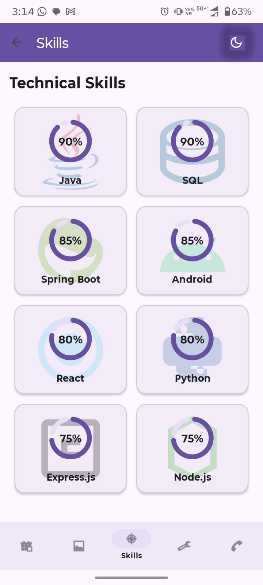
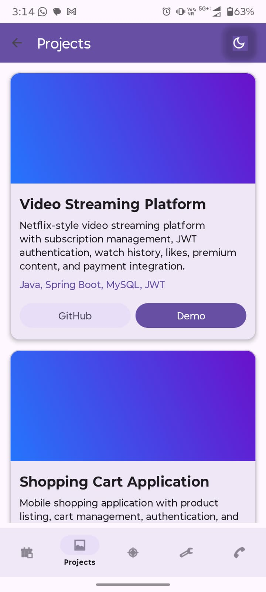
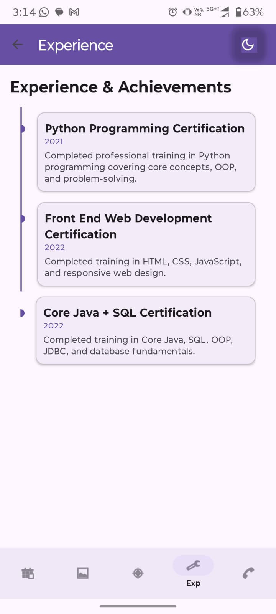
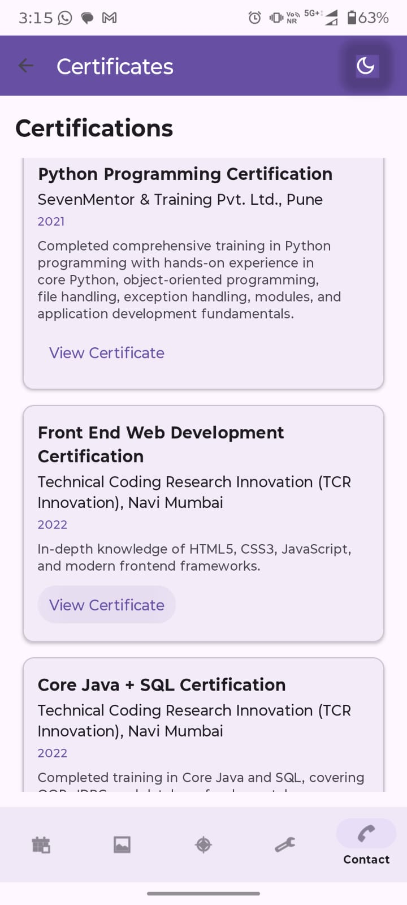
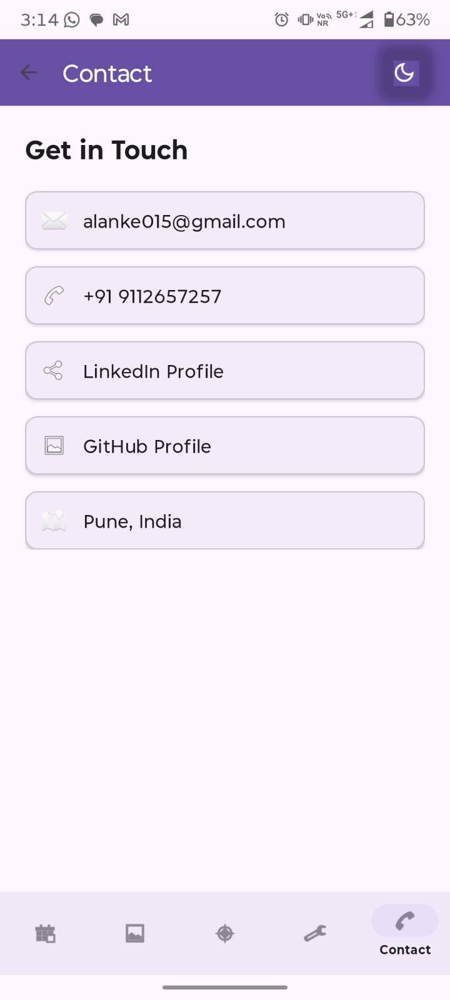

# 📱 My Portfolio App

A modern and interactive Android Portfolio application built using **Java** and **Android Studio**. This app showcases my profile, technical skills, projects, certifications, experience, and contact information through a clean and user-friendly interface.

---

## ✨ Features

- 🚀 Splash Screen with animation
- 🏠 Home Screen
- 👤 About Me
- 💻 Skills
- 📂 Projects
- 💼 Experience
- 🏆 Certificates
- 📞 Contact Information
- 🌙 Dark / Light Theme Toggle
- 🎨 Material Design UI
- 📱 Responsive Layout
- 🧭 Bottom Navigation

---

## 🛠 Tech Stack

| Technology | Usage |
|------------|-------|
| Java | Application Development |
| Android Studio | IDE |
| XML | UI Design |
| Material Components | Modern UI |
| Navigation Component | Fragment Navigation |
| Glide | Image Loading |
| Lottie | Animations |
| SharedPreferences | Theme Persistence |

---

## 📂 Project Structure

```
app/
 ├── activities/
 │    └── SplashActivity
 ├── fragments/
 │    ├── Home
 │    ├── About
 │    ├── Skills
 │    ├── Projects
 │    ├── Experience
 │    ├── Certificates
 │    └── Contact
 ├── adapters/
 ├── models/
 ├── res/
 └── MainActivity
```

---

## 📸 Screenshots


### Splash Screen



### Home



### About



### Skills



### Projects



### Experience



### Certificates



### Contact



---

## 🚀 Getting Started

### Clone the Repository

```bash
git clone https://github.com/AmitLanke015/MyPortfolio.git
```

### Open Project

Open the project using **Android Studio**.

### Build

- Sync Gradle
- Run on an Emulator or Android Device

---

## 📋 Requirements

- Android Studio
- Android SDK 30+
- Java 11

---

## 🌟 Highlights

- Clean and modular architecture
- Smooth navigation between screens
- Persistent dark/light mode
- Animated splash screen
- Material Design interface
- Easy to customize and extend

---

## 🔮 Future Improvements

- Resume Download
- Social Media Integration
- Firebase Contact Form
- Project Filtering
- Blog Section
- Multi-language Support

---

## 👨‍💻 Author

**Amit Lanke**

GitHub: https://github.com/AmitLanke015

---

## ⭐ Support

If you found this project helpful, consider giving it a **⭐ Star** on GitHub.

It helps others discover the project and motivates future improvements.

---

## 📄 License

This project is licensed under the AMIT License.
